<center> <h1> CENTRALIZED CONTROL OF AUTOPILOTS (DIPLOMA) </h1> </center>
<div style = "width: 100%; text-align: right;"> created by GeorgiaFrankinStain </div>
<hr>

**russian** version in "_readme/README_russian.md"

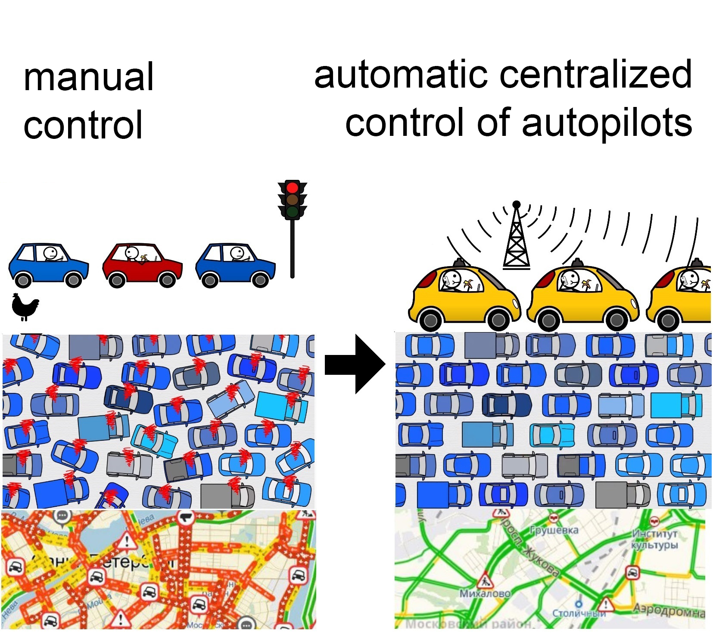

# CONTENTS <a name="coderzanie"> </a>

* <a name="VgfaJD_from"> </a> [INTRODUCTION](#VgfaJD)
    * <a name="CwdnfT_from"> </a> [Relevance of work](#CwdnfT)
    * <a name="GEmdzE_from"> </a> [Causes of traffic jams](#GEmdzE)
* <a name="umJbVO_from"> </a> [PROBLEM STATEMENT](#umJbVO)
    * <a name="MrkUYT_from"> </a> [Tasks](#MrkUYT)
    * <a name="BCFLbz_from"> </a> [Assumptions and Conventions](#BCFLbz)
    * <a name="kjySdn_from"> </a> [Terms of reference for the algorithm](#kjySdn)
* <a name="uqupDz_from"> </a> [CCA (Central Control of Autopilot) Algorithm](#uqupDz)
    * <a name="KhRyto_from"> </a> [Spacetime](#KhRyto)
    * <a name="nGAamu_from"> </a> [A-Star with bypass priority](#nGAamu)
    * <a name="wqSmie_from"> </a> [Along a pre-built graph of reference routes.](#wqSmie)
    * <a name="testdf_from"> </a> [Spatio-temporal A-Star bypass priority along a predefined graph of reference routes.](#testdf)
    * <a name="kDeQpb_from"> </a> [Floyd's Algorithm](#kDeQpb)
* <a name="uKQJUz_from"> </a> [Architecture](#uKQJUz)
    * <a name="bceSFE_from"> </a> [ConsoleManager](#bceSFE)
    * <a name="KELgKX_from"> </a> [Observer](#KELgKX)
    * <a name="dNtpWm_from"> </a> [MovingObject](#dNtpWm)
    * <a name="BMiwsE_from"> </a> [AutoDisainerMachines](#BMiwsE)
    * <a name="suPPig_from"> </a> [ControlledMachine](#suPPig)
    * <a name="WmIoRg_from"> </a> [FootprintSpaceTime](#WmIoRg)
    * <a name="xddMdt_from"> </a> [AreasBenchmarkPaths](#xddMdt)
    * <a name="pjhhVM_from"> </a> [LandScape](#pjhhVM)
    * <a name="TPDuvE_from"> </a> [HistChanges](#TPDuvE)
    * <a name="tGraWz_from"> </a> [Render](#tGraWz)
* <a name="RPtdsF_from"> </a> [Experiments with implemented functionality](#RPtdsF)
* <a name="fuUchX_from"> </a> [UNDER DEVELOPMENT](#fuUchX)
    * <a name="lWPHYY_from"> </a> [Sample interface](#lWPHYY)
    * <a name="xLXgmZ_from"> </a> [Test cards](#xLXgmZ)


# <a name="VgfaJD"> INTRODUCTION </a> [🕮](#coderzanie)

## <a name="CwdnfT"> Relevance of work </a> [🕮](#coderzanie)

Centralized traffic management will make road traffic more efficient, eliminate the problem of traffic jams, and allow cars to move faster.

For the foreseeable future, most of the cars will be driven by autopilots.
The traffic jam problem (and many other logistical problems) arise from poorly coordinated vehicle movements. Traffic regulations address these problems, but not completely. The human factor remains (selfish behavior, rule breaking, slow reaction). The centralized distribution of routes to autopilots under the control of the program completely solves these problems.

## <a name="GEmdzE"> Causes of traffic jams </a> [🕮](#coderzanie)
With low coordination of the movement of cars, phantom intersections may occur, due to the fact that someone slowed down, the next one, and the next, etc.


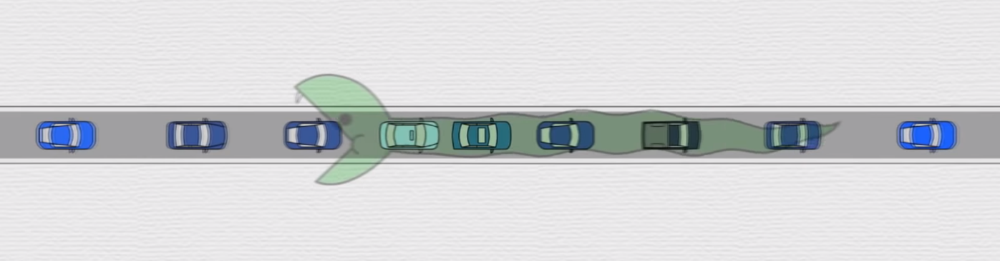
<center>
<i> phantom intersection </i>
</center>

Due to poor human coordination, traffic jams can occur even when driving on a circular closed track without obstacles, without traffic lights with several cars.

Traffic jams can occur in the absence of obstacles, even when drivers specifically try to coordinate and not create traffic jams. No matter how hard the drivers try, they cannot move in an organized way for more than 5 minutes. (link to the video recording of the experiment in the bibliography under the title "Video recording of the experiment with cars moving in a circle without obstacles").

<center> 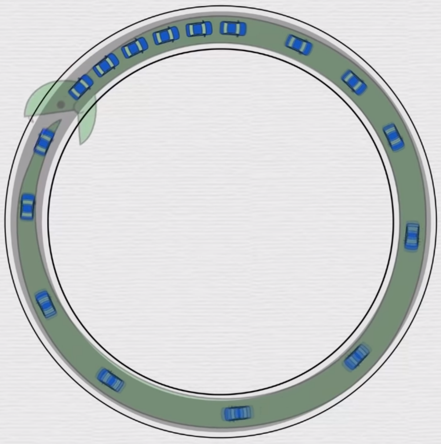 </center>
<center> <i> Traffic jam on an unobstructed ring track with few cars. </i>
</center>
</center>

# <a name="umJbVO"> PROBLEM STATEMENT </a> [🕮](#coderzanie)

## <a name="MrkUYT"> Tasks </a> [🕮](#coderzanie)

* Develop a centralized logistic algorithm (hereinafter referred to as CCP (Central Control of Autopilots), which should:
    - distribute driving routes to each connected autopilot vehicle.
    - organize traffic without traffic jams, congestion, etc.
* Develop a simulation of the movement of machines for debugging and demonstrating the operation of the algorithm.

## <a name="BCFLbz"> Assumptions and Conventions </a> [🕮](#coderzanie)

* The machine can turn sharply 90 degrees
* Traffic does not have to be similar to the Rules of the Road

## <a name="kjySdn"> Terms of reference for the algorithm </a> [🕮](#coderzanie)

- As long as it is possible to get to the point of arrival, the CKA should lead cars there
- CKA must successfully overcome
    + Static obstacles (buildings, etc.)
    + Dynamic obstacles (uncontrolled cars moving chaotically; collapsing/suddenly appearing buildings; traffic lights with a button, etc.)
- System response time: 1 second (instructions for new conditions should appear in a second).
- Machines to the CCP system can be connected/disconnected suddenly.

# <a name="uqupDz"> CCA (Central Control Autopilot) Algorithm </a> [🕮](#coderzanie)

To accomplish the tasks, an algorithm was developed:

Spatio-temporal A-Star with the priority of traversing a pre-built graph of reference routes.

## <a name="KhRyto"> Spacetime </a> [🕮](#coderzanie)

**Space-time** A-Star with the priority of traversing a pre-built graph of reference routes.

Space-time means that the algorithm stores the position of each machine at each moment in time. This allows
    firstly) avoid not only stationary obstacles, but also dynamic
    secondly) it allows you to find the optimal path, since you can plan a route throughout the entire movement of the car.


<center> 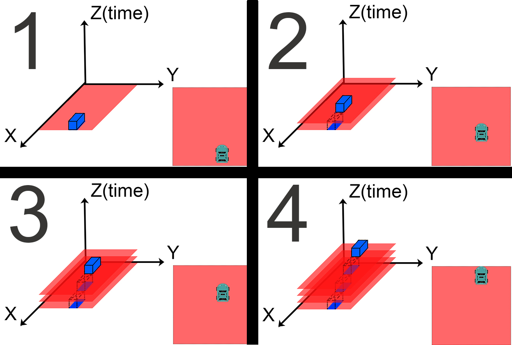 </center>
<center> <i> Storing the history of vehicle movement. </i> </center>

## <a name="nGAamu"> A-Star with crawl priority </a> [🕮](#coderzanie)

Space-time **A-Star with traversal priority** along a pre-built graph of reference routes.

ASstar with bypass priority. The standard algorithm for fast search for the shortest path ACstar is taken as a basis. This algorithm returns the first good solution it finds. ACStar first of all goes through the nodes with the smallest weight. The weight of the node is the sum of the distance traveled and the approximate distance to the target. The approximate distance is estimated by a heuristic function.

## <a name="wqSmie"> Using a previously built graph of reference routes. </a> [🕮](#coderzanie)

Spatio-temporal A-Star bypass priority by **pre-built graph of reference routes.**

In this case, the role of a heuristic function is played by reference routes, which were previously constructed using the Floyd's algorithm. Floyd's algorithm finds the best route between each pair of points.

The cost of a node in the developed algorithm consists of the time passed and the estimated time to the goal. A node cost based on time rather than distance allows you to find better routes where it is sometimes faster to wait and let a passing car pass than to go around it.


## <a name="testdf"> Spatio-Temporal A-Star Traversal Priority </a> a pre-built graph of reference routes. [🕮](#coderzanie)

**Spatio-temporal A-Star bypass priority along a pre-built graph of reference routes.**

The developed algorithm allows you to find the fastest way to the target, bypassing all types of obstacles.

an experiment was carried out in which
    cars are added at a random time, in a random place
    but at the same time, each has predetermined points of arrival at the parking lot


the video shows
That cars do not crash into each other and successfully go around a stationary obstacle.


cars can pass through the previously occupied place.
cars do not need traffic lights to coordinate. Accordingly, there is no need to waste time standing at traffic lights.
you can also see that cars can stop in advance and let passing cars pass if the wait takes less time than going around the cars passing by.


## <a name="kDeQpb"> Floyd's Algorithm </a> [🕮](#coderzanie)

Algorithm for finding the shortest distances between all pairs of vertices in a weighted directed graph. Used to build reference routes.
At each step, the algorithm generates matrix W. Matrix W contains the lengths of the shortest paths between all vertices of the graph. Before the operation of the algorithm, the matrix W is filled with the lengths of the edges of the graph (or prohibitively large M, if there are no edges).

```
for k = 1 to n
  for i = 1 to n
    for j = 1 to n
      W [i] [j] = min (W [i] [j], W [i] [k] + W [k] [j])
```

<center> 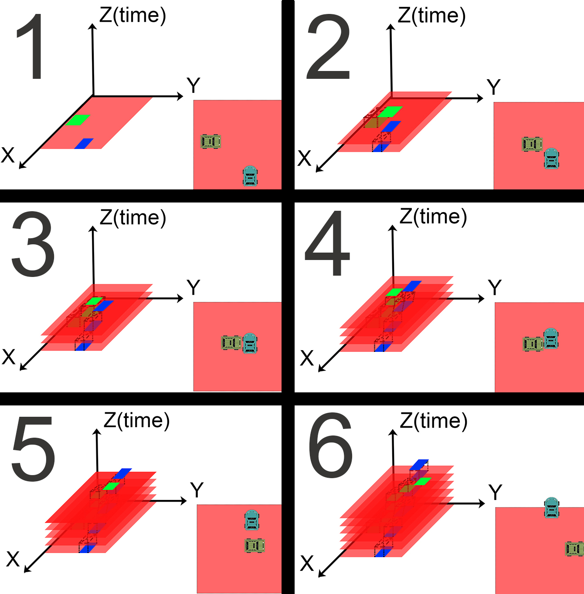 </center>
<center> <i> Driving through a previously occupied place (overcoming dynamic obstacles). </i> </center>


# <a name="uKQJUz"> Architecture </a> [🕮](#coderzanie)

During the development, GoF patterns were applied.

Any call to the class goes through the interface. This gives flexibility (= minimal class coupling) to the code, and therefore faster development. For example: very useful during tests, when a class is placed under the interface that mimics rare behavior.

All business logic is protected from external libraries and frameworks by an interface layer. Logic has its own Random function in the Wrapper package. There is its own library for working with files (the DataInputOut package), which in turn is a wrapper around the standard library. This allows you to save a lot of time when changing frameworks, libraries - no need to change function calls in the entire code of the Logic package.
- ConsoleManagement (the interface into which text commands are submitted from the user side)
- GUI (Changing this package does not affect anything at all. There can be several graphical interfaces at once. This is generally a separate application that periodically asks the Logic package for the position of machines in a certain area.)
- **Logic**
- Wrapper (wrapper of standard objects of the Random type. In the case of debugging, it is very convenient when random numbers can be made not random).
- DataInputOut (A wrapper around libraries for working with files, databases, etc. If you store information in a new format, you don't have to redo everything in the Logic package)


<center> 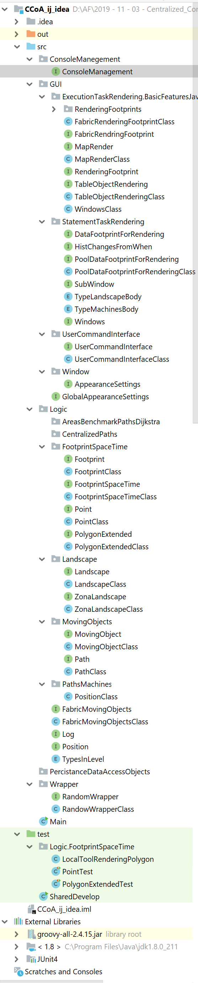 </center>
<center> <i> List of project classes. </i> </center>


<center> 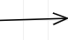 </center>
<center> <i> Reference to another class with object change. </i> </center>

<center> 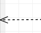 </center>
<center> <i> Referencing another class, retrieving data without changing the object. </i> </center>

<center> 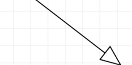 </center>
<center> <i> Interface implementation (generalization) </i> </center>

<center> 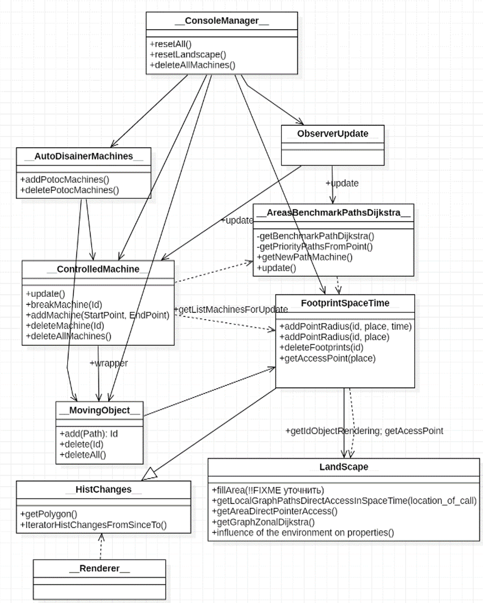 </center>
<center> <i> UML project diagram </i> </center>


## <a name="bceSFE"> ConsoleManager </a> [🕮](#coderzanie)
The system is controlled by text commands. This interface was chosen as the most flexible. ConsoleManager converts text commands into function calls of specific classes.

## <a name="KELgKX"> Observer </a> [🕮](#coderzanie)
Observer class. ConsoleManager after some changes (for example, landscape) informs the Observer about the need to update. The observer broadcasts the update notification to the appropriate classes in the correct order.

## <a name="dNtpWm"> MovingObject </a> [🕮](#coderzanie)
The class is engaged in creating objects of cars, taking them into account, and is responsible for leaving traces in an object of the FootprintSpaceTime class.

## <a name="BMiwsE"> AutoDisainerMachines </a> [🕮](#coderzanie)
The class is responsible for the functioning of threads that create cars with a predetermined point of arrival.

## <a name="suPPig"> ControlledMachine </a> [🕮](#coderzanie)
The class is responsible for providing a route for the car from point A to point B. Strictly speaking, this is where the main logistic algorithm will work (see point 1).

## <a name="WmIoRg"> FootprintSpaceTime </a> [🕮](#coderzanie)
Space-time traces. The class is responsible for

- Storing information about the position of the machine in space and time
- Issuance of information about the occupancy of a place by a certain machine
- Resolution of conflicts of collisions of cars, buildings, etc.

## <a name="xddMdt"> AreasBenchmarkPaths </a> [🕮](#coderzanie)
This class is responsible for:
- compilation of reference routes from direct access points
- distribution of routes to autopilot cars

## <a name="pjhhVM"> LandScape </a> [🕮](#coderzanie)
Subclass of FootprintSpaceTime. Responsible for issuing information about the permeability through static objects (stationary objects).

## <a name="TPDuvE"> HistChanges </a> [🕮](#coderzanie)
Returns changes for the requested amount of time.

## <a name="tGraWz"> Render </a> [🕮](#coderzanie)
A renderer for a specific area of ​​the map.


# <a name="RPtdsF"> Experiments with the implemented functionality </a> [🕮](#coderzanie)

Experiments were performed to test the system. Experimental conditions:
- cars were added at a random time, in a random place
- points of arrival at the "parking lot" are predefined
- it is necessary to go around a stationary obstacle

The algorithm successfully coped with the tasks:
- cars do not crash into each other and into stationary obstacles
- stop in advance to let passing cars pass, if it takes less time to wait than to go around nearby cars.


<center> 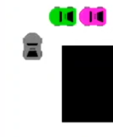 </center>
<center> <i> Two cars stopped to let the gray car pass </i> </center>

- the machines feel that the previously occupied space has been vacated. (they can drive through places that were previously bypassed, as they were occupied by other cars)
- they work without traffic lights (the advantage is that cars do not stand at traffic lights most of the time)
Algorithm implementation flaws:
- car number 9, when moving from the lower left corner to the upper left corner, periodically turns to the right unnecessarily

<center> 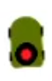 </center>
<center> <i> Defective machine # 9 </i> </center>


<center> <a href="https://youtu.be/lgNUmRd3vHg?t=1" target="_blank">  </a> </center>
<center> <i> YouTube Experiment Video </i> </center>


<center> 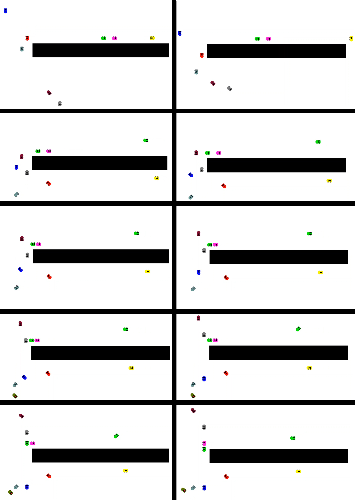 </center>
<center> <i> Vehicle movement from 3 to 14 seconds. </i> </center>


# <a name="fuUchX"> IN THE PROCESS OF DEVELOPMENT </a> [🕮](#coderzanie)

In future plans, we will finalize the functionality so that it is possible to enter the arrangement of machines into the program through the program interface, files. At the moment, machine routes can be entered into the program by calling functions in the main function. Points A and B are passed to the function, and the program itself builds a detailed route, without traffic jams of collisions with other cars.

## <a name="lWPHYY"> Sample interface </a> [🕮](#coderzanie)

The meaning of colors on the map
1. <span style = "color: green; font-weight: bold;"> Green - grass, normal traffic zone. </span>
2. <span style = "color: blue; font-weight: bold;"> Blue - river (impassable for regular cars) </span>
3. <span style = "color: gray; font-weight: bold;"> Gray - asphalt, highest traffic area </span>
4. Building picture - building, impassable
5. <span style = "color: black; font-weight: bold;"> Black is an impassable obstacle </span>

<table>
    <tr>
        <td> <div style = "text-align: right;"> Change Terrain </div> </td>
        <td>  </td>
        <td rowspan = "6">  </td>
    </tr>
    <tr>
        <td> <div style = "text-align: right;"> Add flow creating </div> </td>
        <td> 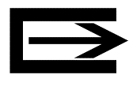 </td>
    </tr>
    <tr>
        <td> <div style = "text-align: right;"> Add absorbing flow </div> </td>
        <td> 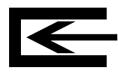 </td>
    </tr>
    <tr>
        <td> <div style = "text-align: right;"> Add car </div> </td>
        <td>  </td>
    </tr>
    <tr>
        <td> <div style = "text-align: right;"> Delete (eraser, clear) </div> </td>
        <td>  </td>
    </tr>
    <tr>
        <td> <div style = "text-align: right;"> Make it destroyed </div> </td>
        <td>  </td>
    </tr>
</table>


## <a name="xLXgmZ"> Test Maps </a> [🕮](#coderzanie)

In future plans, we will improve the functionality so that the program can handle the following situations.

Maps on which the algorithm should work. Maps test cornerstone situations in which algorithm malfunctions are likely to occur.


<table>
    <tr>
        <td> 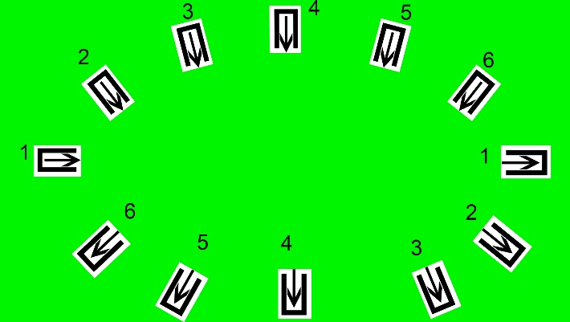 <center> Clock </center> </td>
        <td> 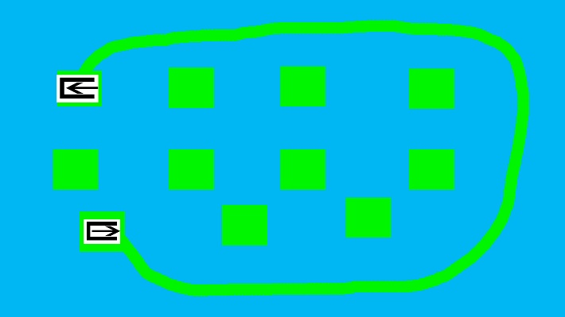 <center> Islands </center> </td>
    </tr>
    <tr>
        <td> 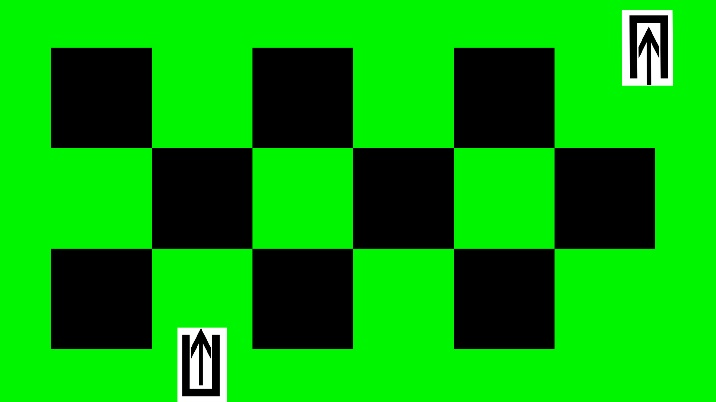 <center> Chess </center> </td>
        <td>  <center> Large stone traversal </center> </td>
    </tr>
    <tr>
        <td> 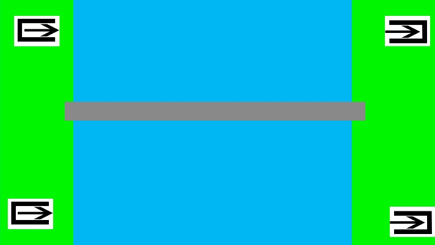 <center> Long bridge </center> </td>
        <td> 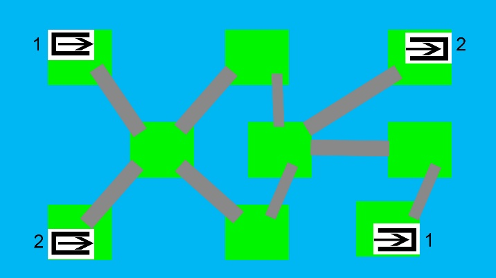 <center> Many bridges </center> </td>
    </tr>
    <tr>
        <td>  <center> Check for patency in the gorge </center> </td>
        <td> 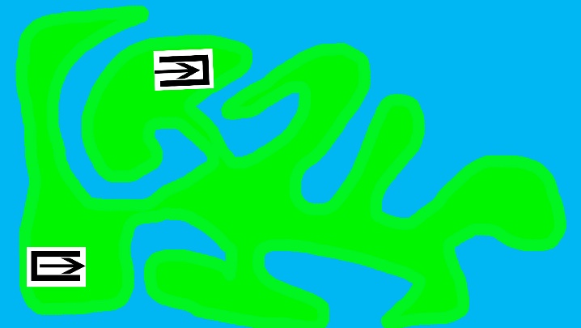 <center> Amoeba spot </center> </td>
    </tr>
</table>