<center><h1>CENTRALIZED CONTROL OF AUTOPILOTS (DIPLOMA)</h1></center>
<div style="width: 100%; text-align: right; ">created by GeorgiaFrankinStain</div>
<hr>


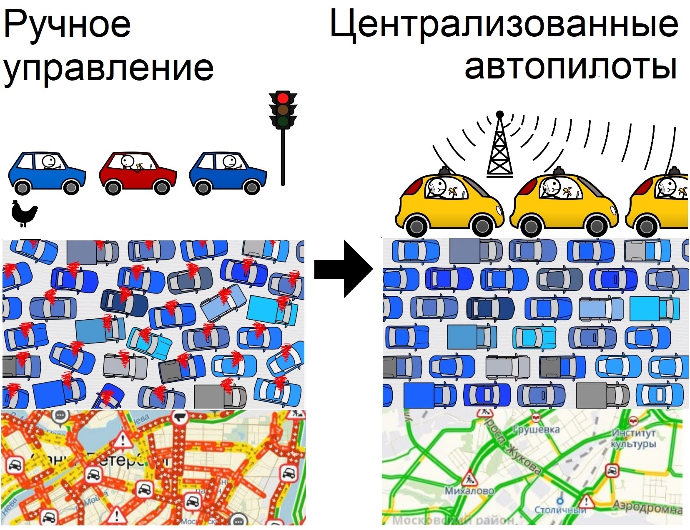

# СОДЕРЖАНИЕ <a name="coderzanie"></a>

* <a name="VgfaJD_from"></a> [ВВЕДЕНИЕ](#VgfaJD)
    * <a name="CwdnfT_from"></a> [Актуальность работы](#CwdnfT)
    * <a name="GEmdzE_from"></a> [Причины возникновения пробок](#GEmdzE)
* <a name="umJbVO_from"></a> [ПОСТАНОВКА ЗАДАЧИ](#umJbVO)
    * <a name="MrkUYT_from"></a> [Задачи](#MrkUYT)
    * <a name="BCFLbz_from"></a> [Допущения и условности](#BCFLbz)
    * <a name="kjySdn_from"></a> [Техническое задание для алгоритма](#kjySdn)
* <a name="uqupDz_from"></a> [Алгоритм ЦКА (Центрального Контроля Автопилотов)](#uqupDz)
    * <a name="KhRyto_from"></a> [Пространственно-временной](#KhRyto)
    * <a name="nGAamu_from"></a> [A-Star с приоритетом обхода](#nGAamu)
    * <a name="wqSmie_from"></a> [По заранее построенному графу эталонных маршрутов.](#wqSmie)
    * <a name="testdf_from"></a> [Пространственно-временной A-Star приоритетом обхода по заранее построенному графу эталонных маршрутов.](#testdf)
    * <a name="kDeQpb_from"></a> [Алгоритм Флойда](#kDeQpb)
* <a name="uKQJUz_from"></a> [Архитектура](#uKQJUz)
    * <a name="bceSFE_from"></a> [ConsoleManager](#bceSFE)
    * <a name="KELgKX_from"></a> [Observer](#KELgKX)
    * <a name="dNtpWm_from"></a> [MovingObject](#dNtpWm)
    * <a name="BMiwsE_from"></a> [AutoDisainerMachines](#BMiwsE)
    * <a name="suPPig_from"></a> [ControlledMachine](#suPPig)
    * <a name="WmIoRg_from"></a> [FootprintSpaceTime](#WmIoRg)
    * <a name="xddMdt_from"></a> [AreasBenchmarkPaths](#xddMdt)
    * <a name="pjhhVM_from"></a> [LandScape](#pjhhVM)
    * <a name="TPDuvE_from"></a> [HistChanges](#TPDuvE)
    * <a name="tGraWz_from"></a> [Render](#tGraWz)
* <a name="RPtdsF_from"></a> [Эксперименты с реализованным функционалом](#RPtdsF)
* <a name="fuUchX_from"></a> [В ПРОЦЕССЕ РАЗРАБОТКИ](#fuUchX)
    * <a name="lWPHYY_from"></a> [Примерный вид интерфейса](#lWPHYY)
    * <a name="xLXgmZ_from"></a> [Тестовые карты](#xLXgmZ)


# <a name="VgfaJD"> ВВЕДЕНИЕ</a> [🕮](#coderzanie)

## <a name="CwdnfT"> Актуальность работы</a> [🕮](#coderzanie)

Централизованное управление автомобильным трафиком сделает движение на дорогах более эффективным, устранит проблему пробок, позволит быстрее перемещаться автомобилям.

В обозримом будущем машины по большей части будут управляться автопилотами.
Проблема пробок (и многие другие логистические проблемы) возникают вследствие плохо согласованного движения машин. Правила дорожного движения решают эти проблемы, но не полностью. Остается человеческий фактор (эгоистичное поведение, нарушение правил, медленная реакция). Централизованная раздача маршрутов автопилотам под управлением программы полностью решает эти проблемы.

## <a name="GEmdzE"> Причины возникновения пробок</a> [🕮](#coderzanie)
При низкой координации движения машин могут возникать фантомные перекрестки, из-за того, что кто-то притормозил, за ним следующий, а за ним следующий и т.д.


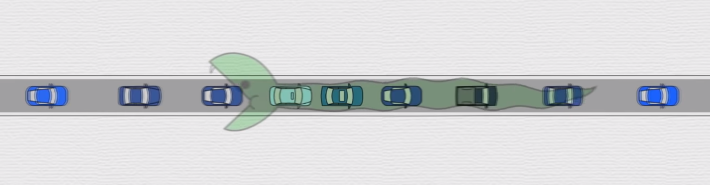
<center>
<i>фантомный перекресток</i>
</center>

Из-за плохой человеческой координации могут возникать пробки даже при движении на круглой замкнутой трассе без препятствий, без светофоров с несколькими машинами.

Пробки могут возникать при отсутствии препятствий, даже когда водители специально пытаются скоординироваться и не создавать пробок. Как бы водители не старались, у них не получается двигаться организованно более 5 минут. (ссылка на видеозапись проведенного эксперимента в списке литературы под названием «Видеозапись проведенного эксперимента с движением машин по кругу без препятствий»).

<center>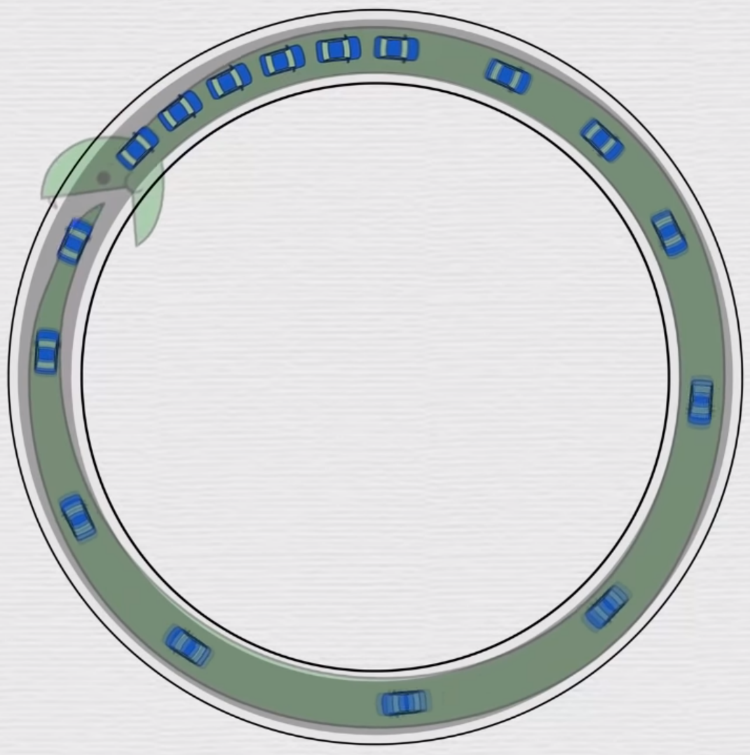</center>
<center><i>Пробка на кольцевой трассе без препятствий с небольшим количеством машин.</i>
</center>
</center>

# <a name="umJbVO"> ПОСТАНОВКА ЗАДАЧИ</a> [🕮](#coderzanie)

## <a name="MrkUYT"> Задачи</a> [🕮](#coderzanie)

* Разработать централизованный логистический алгоритм (в дальнейшем называемый ЦКА (Центральный Контроль Автопилотов), который должен:
    - раздать маршруты движения каждой подключенной автопилотируемой машине.
    - организовать движение без пробок, заторов и т.п.
* Разработать симуляцию движения машин, для отладки и демонстрации работы алгоритма.

## <a name="BCFLbz"> Допущения и условности</a> [🕮](#coderzanie)

* Машина может резко поворачивать на 90 градусов
* Движение не обязано быть похожим на Правила Дорожного Движения

## <a name="kjySdn"> Техническое задание для алгоритма</a> [🕮](#coderzanie)

- Пока есть возможность доехать до точки прибытия, ЦКА должен вести туда машины
- ЦКА должен успешно преодолевать
    + Статичные препятствия (здания т.п.)
    + Динамические препятствия (неподконтрольные машины хаотично движущиеся; разрушающиеся/появляющиеся внезапно здания; светофоры с кнопкой и т.п.)
- Время отклика системы: 1 секунда (инструкции под новые условия должны появиться уже через секунду).
- Машины к системе ЦКА могут подключаться/отключаться внезапно.

# <a name="uqupDz"> Алгоритм ЦКА (Центрального Контроля Автопилотов)</a> [🕮](#coderzanie)

Для выполнения поставленных задач был разработан алгоритм:

Пространственно-временной A-Star с приоритетом обхода по заранее построенному графу эталонных маршрутов.

## <a name="KhRyto"> Пространственно-временной</a> [🕮](#coderzanie)

**Пространственно-временной** A-Star с приоритетом обхода по заранее построенному графу эталонных маршрутов.

Пространственно-временной означает, что алгоритм хранит положение каждой машины в каждый момент времени. Это позволяет
    во первых) объезжать не только стационарные препятствия, но и динамические
    во вторых) это позволяет найти оптимальный путь, так как можно планировать маршрут на протяжении всего движения машины.


<center>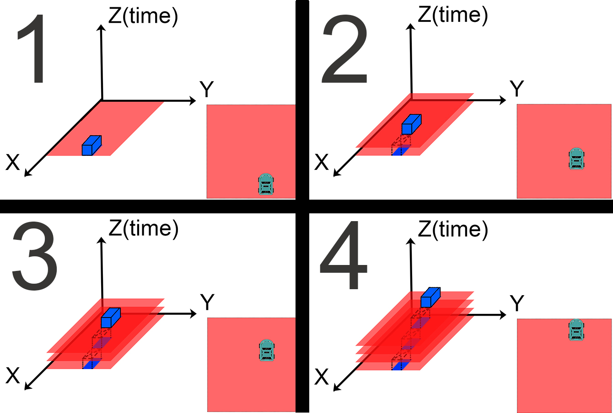</center>
<center><i>Хранение истории движения машины.</i></center>

## <a name="nGAamu"> A-Star с приоритетом обхода</a> [🕮](#coderzanie)

Пространственно-временной **A-Star с приоритетом обхода** по заранее построенному графу эталонных маршрутов.

АСтар с приоритетом обхода. За основу взят стандартный алгоритм быстрого поиска кратчайшего пути АСтар. Этот алгоритм возвращает первое найденное неплохое решение. АСтар в первую очередь перебирает узлы с наименьшим весом. Вес узла складывается из пройденного расстояния и примерного расстояния до цели. Примерное расстояние оценивает эвристическая функция.

## <a name="wqSmie"> По заранее построенному графу эталонных маршрутов.</a> [🕮](#coderzanie)

Пространственно-временной A-Star приоритетом обхода по **заранее построенному графу эталонных маршрутов.**

В данном случае роль эвристической функции играют эталонные маршруты, заранее построенные по алгоритму Флойда. Алгоритм Флойда находит наилучший маршрут между каждой парой точек.

Стоимость узла в разработанном алгоритме складывается из пройденного времени и предполагаемого времени до цели. Стоимость узла, основанная на времени, а не на расстоянии позволяет находить более оптимальные маршруты, где иногда быстрее подождать и пропустить проезжающую машину, чем объезжать ее.


## <a name="testdf"> Пространственно-временной A-Star приоритетом обхода по </a>заранее построенному графу эталонных маршрутов. [🕮](#coderzanie)

**Пространственно-временной A-Star приоритетом обхода по заранее построенному графу эталонных маршрутов.**

Разработанный алгоритм позволяет находить самый быстрый путь до цели, объехав все виды препятствий.

был проведен эксперимент в котором
    машины добавляются в случайное время, в случайном месте
    но при этом у каждой заранее заданы точки прибытия на стоянку


на видео видео видно
Что машины не врезаются друг в друга и успешно объезжают стационарное препятствие.


машины могут проезжать по ранее занятому месту.
машинам не нужны светофоры для координации. Соответственно и тратить время, стоя на светофорах, не надо.
так же видно, что машины могут заранее остановиться и пропустить проезжающие мимо машины, если ожидание занимает меньше времени, чем объехать рядом идущие машины.


## <a name="kDeQpb"> Алгоритм Флойда</a> [🕮](#coderzanie)

Алгоритм нахождения кратчайших расстояний между всеми парами вершин во взвешенном ориентированном графе. Используется для построения эталонных маршрутов.
На каждом шаге алгоритм генерирует матрицу W. Матрица W содержит длины кратчайших путей между всеми вершинами графа. Перед работой алгоритма матрица W заполняется длинами рёбер графа (или запредельно большим M, если ребра нет).

```
for k = 1 to n
  for i = 1 to n
    for j = 1 to n
      W[i][j] = min(W[i][j], W[i][k] + W[k][j])
```

<center>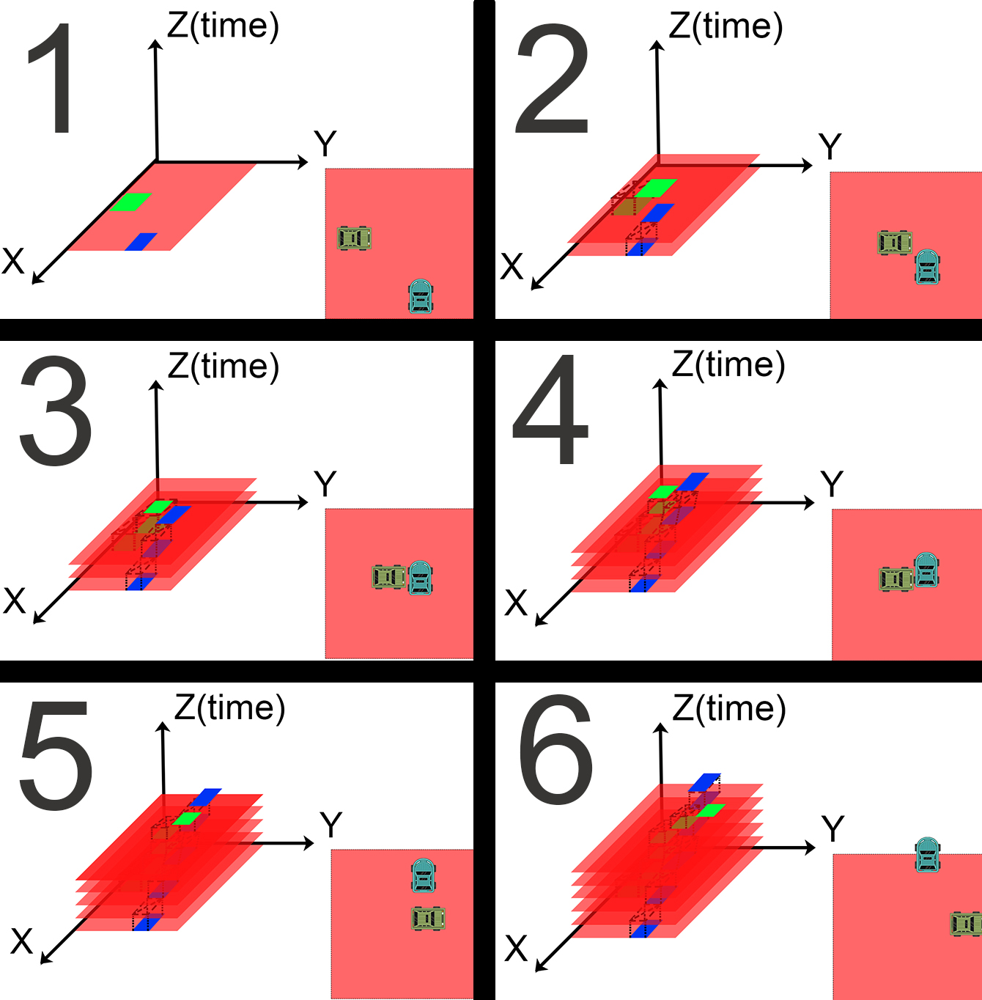</center>
<center><i>Проезд по ранее занятому месту (предоление динамических препятствий).</i></center>


# <a name="uKQJUz"> Архитектура</a> [🕮](#coderzanie)

При разработки были применены паттерны GoF.

Любое обращение к классу идет через интерфейс. Это дает гибкость (= минимальную связанность классов) коду, а значит более быструю разработку. Например: очень полезно во время тестов, когда под интерфейс помещается класс имитирующий редкое поведение.

Вся бизнес-логика защищена от внешних библиотек, фреймворков прослойкой интерфейсов. У логики есть своя функция Random в пакете Wrapper. Есть своя собственная библиотека для работы с файлами (пакет DataInputOut), которая в свою очередь является оболочкой стандартной библиотеки. Это позволяет сэкономить много времени при смене фреймворка, библиотеки - не надо менять вызовы функции во всем коде пакета Logic.
- ConsoleManagement (интерфейс, в который подаются текстовые команды со стороны пользователя)
- GUI (Изменение этого пакета вообще ни на что не влияет. Графических интерфейсов может быть сразу несколько. Это вообще отдельное приложение, которое периодически спрашивает у пакета Logic положение машин в определенной области.)
- **Logic**
- Wrapper (оболочка стандартных объектов по типу Random. В случае отладки очень удобно, когда случайные числа можно сделать не случайными).
- DataInputOut (Оболочка библиотек работы с файлами, базами данных и т.п. В случае хранения информации в новом формате не придется переделывать всё в пакете Logic)


<center>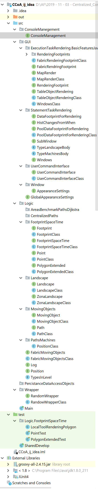</center>
<center><i>Список классов проекта.</i></center>


<center>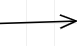</center>
<center><i>Обращение к другому классу с изменением объекта. </i></center>

<center>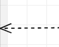</center>
<center><i>Обращение к другому классу, получение данных без изменения объекта.</i></center>

<center></center>
<center><i>Реализация интерфейса (обобщение)</i></center>

<center>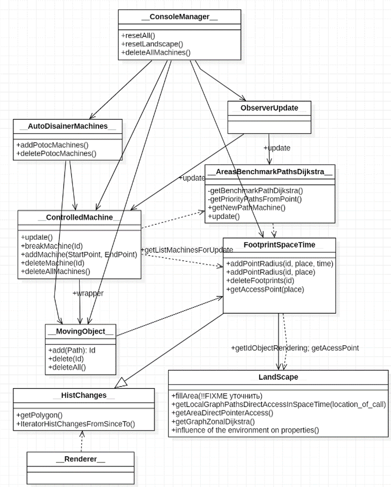</center>
<center><i>Проезд по ранее занятому месту (предоление динамических препятствий).</i></center>


## <a name="bceSFE"> ConsoleManager</a> [🕮](#coderzanie)
Используется управление системой текстовыми командами. Такой интерфейс был выбран, как максимально гибкий. ConsoleManager перерабатывает текстовые команды в вызовы функций определенных классов.

## <a name="KELgKX"> Observer</a> [🕮](#coderzanie)
Класс Наблюдатель. ConsoleManager после некоторых изменений (например ландшафта) сообщает Наблюдателю о необходимости обновления. Наблюдатель передает оповещение об обновлении соответствующим классам в нужном порядке.

## <a name="dNtpWm"> MovingObject</a> [🕮](#coderzanie)
Класс занимается созданием объектов машин, их учетом, отвечает за оставление следов в объекте класса FootprintSpaceTime.

## <a name="BMiwsE"> AutoDisainerMachines</a> [🕮](#coderzanie)
Класс отвечает за функционирование потоков, создающих машины с заранее заданной точкой прибытия.

## <a name="suPPig"> ControlledMachine</a> [🕮](#coderzanie)
Класс отвечает за предоставление маршрута машине из точки А в точку B. Собственно говоря, здесь и будет работать главный логистический алгоритм (см. пункт 1).

## <a name="WmIoRg"> FootprintSpaceTime</a> [🕮](#coderzanie)
Пространственно-временные следы. Класс отвечает за

- Хранение информации о положении машины в пространстве и времени
- Выдачу информации о занятости места определенной машиной
- Решение конфликтов столкновений машин, зданий и т.п.

## <a name="xddMdt"> AreasBenchmarkPaths</a> [🕮](#coderzanie)
Этот класс отвечает за:
- составление эталонных маршрутов из точек прямого доступа
- раздачу маршрутов автопилотируемым машинам

## <a name="pjhhVM"> LandScape</a> [🕮](#coderzanie)
Подкласс FootprintSpaceTime. Отвечает за выдачу информации о проходимости через статические объекты (неподвижные объекты).

## <a name="TPDuvE"> HistChanges</a> [🕮](#coderzanie)
Возвращает изменения за запрошенный промежуток времени.

## <a name="tGraWz"> Render</a> [🕮](#coderzanie)
Отрисовщик определенной области карты.


# <a name="RPtdsF"> Эксперименты с реализованным функционалом</a> [🕮](#coderzanie)

Для тестирования системы были проведены эксперименты. Условия экспериментов:
- машины добавлялись в случайное время, в случайном месте
- заранее заданы точки прибытия на «стоянке»
- необходимо объезжать стационарное препятствие

Алгоритм успешно справился с задачами:
- машины не врезаются друг в друга и в стационарные препятствия
- заранее останавливаются, чтобы пропустить проезжающие мимо машины, если подождать занимает меньше времени, чем объехать рядом едущие машины.


<center></center>
<center><i>Две машины остановились, чтобы пропустить серую машину</i></center>

- машины чувствуют, что место, ранее занятое, освободилось. (могут проезжать по местам, которые ранее объезжали, так как они были заняты другими машинами)
- работают без светофоров (преимущество в том, что машины не стоят на светофорах большую часть времени)
Недоработки реализации алгоритма:
- машина №9 при движении из нижнего левого угла в верхний левый угол периодически поворачивает направо без необходимости

<center>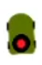</center>
<center><i>Дефектная машина №9</i></center>


<center><a href="https://youtu.be/lgNUmRd3vHg?t=1" target="_blank">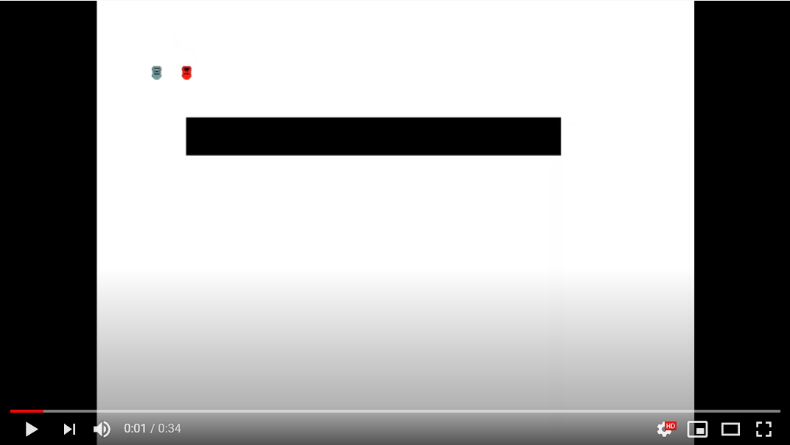</a></center>
<center><i>Видео эксперимента на YouTube</i></center>


<center>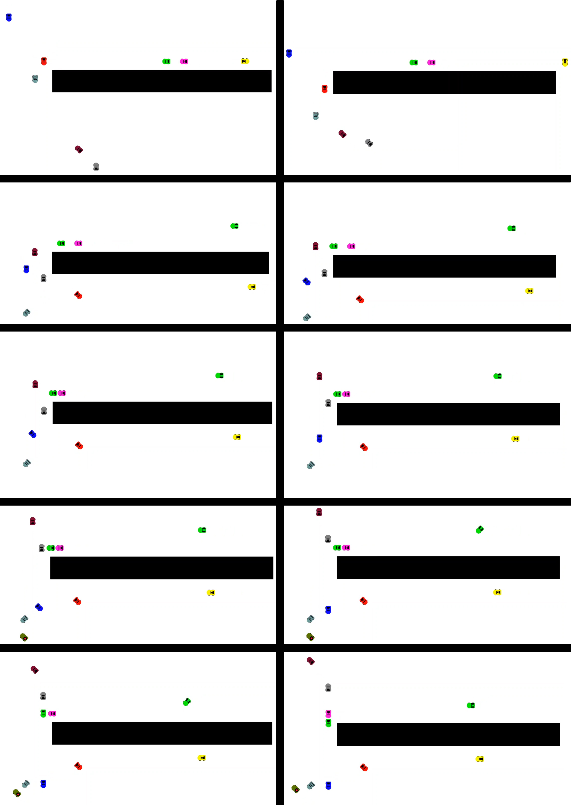</center>
<center><i>Движение машин с 3 по 14 секунду.</i></center>


# <a name="fuUchX"> В ПРОЦЕССЕ РАЗРАБОТКИ</a> [🕮](#coderzanie)

В дальнейших планах доработать функционал, чтобы можно было вводить в программу расстановку машин через интерфейс программы, файлы. В данный момент в программу можно вводить маршруты машин при помощи вызова функций в main функции. В функцию передается точка A и B, а программа сама строить детальный маршрут, без пробок столкновений с другими машинами.

## <a name="lWPHYY"> Примерный вид интерфейса</a> [🕮](#coderzanie)

Значение цветов на карте
1. <span style="color: green; font-weight: bold;">Зеленый – трава, зона обычной проходимости.</span>
2. <span style="color: blue; font-weight: bold;">Синий – река (непроходимо для обычных машин)</span>
3. <span style="color: grey; font-weight: bold;">Серый – асфальт, зона самой высокой проходимости</span>
4. Картинка здания – здание, непроходимо
5. <span style="color: black; font-weight: bold;">Черный – непроходимое препятствие</span>

<table>
    <tr>
        <td><div style="text-align: right;">Изменить ландшафт</div></td>
        <td></td>
        <td rowspan="6">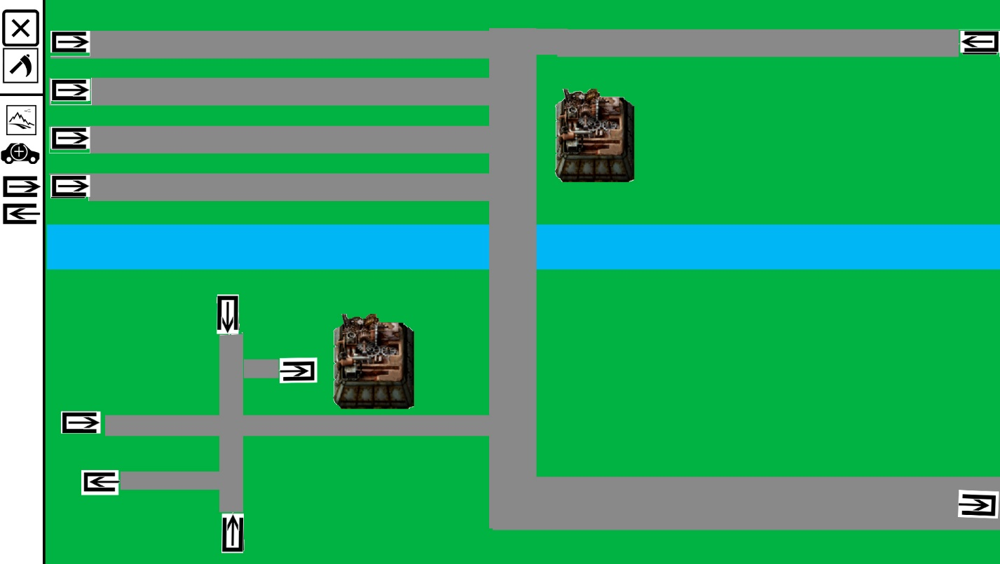</td>
    </tr>
    <tr>
        <td><div style="text-align: right;">Добавить поток создающий</div></td>
        <td>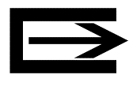</td>
    </tr>
    <tr>
        <td><div style="text-align: right;">Добавить поток поглощающий</div></td>
        <td>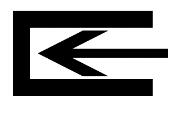</td>
    </tr>
    <tr>
        <td><div style="text-align: right;">Добавить машину</div></td>
        <td></td>
    </tr>
    <tr>
        <td><div style="text-align: right;">Удалить (ластик, очистить)</div></td>
        <td></td>
    </tr>
    <tr>
        <td><div style="text-align: right;">Перевести в состояние разрушен</div></td>
        <td></td>
    </tr>
</table>


## <a name="xLXgmZ"> Тестовые карты</a> [🕮](#coderzanie)

В дальнейших планах доработать функционал, чтобы программа могла обрабатывать следующие ситуации.

Карты, на которых алгоритм должен работать. Карты тестируют краеугольные ситуации, на которых с большой вероятностью проявятся неисправности алгоритма.


<table>
    <tr>
        <td><center>Часы</center></td>
        <td>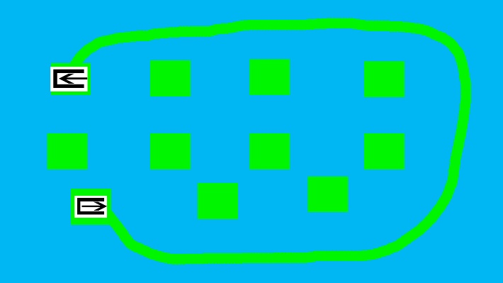<center>Острова</center></td>
    </tr>
    <tr>
        <td>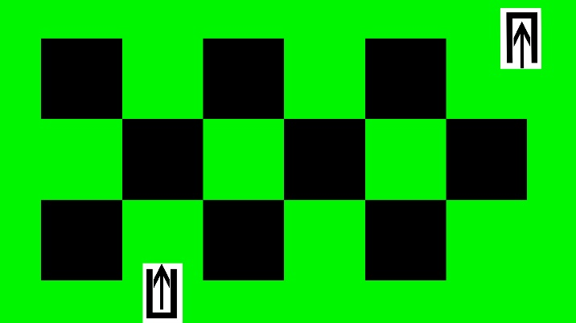<center>Шахматы</center></td>
        <td><center>Обход большого камня</center></td>
    </tr>
    <tr>
        <td>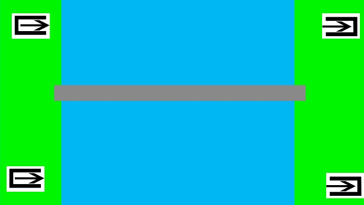<center>Длинный мост</center></td>
        <td>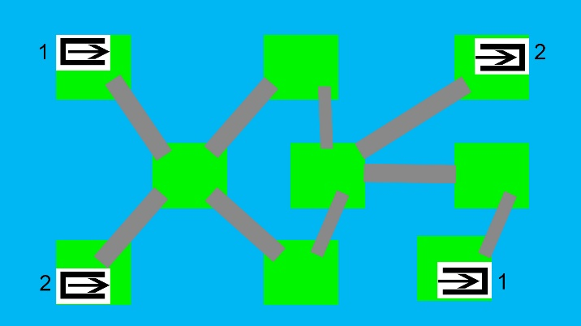<center>Много мостов</center></td>
    </tr>
    <tr>
        <td>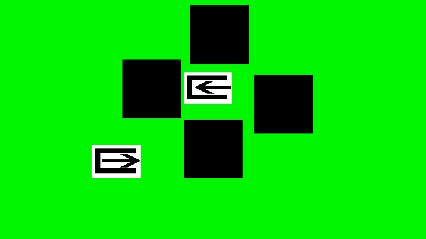<center>Проверка проходимости по размеру в ущелье</center></td>
        <td>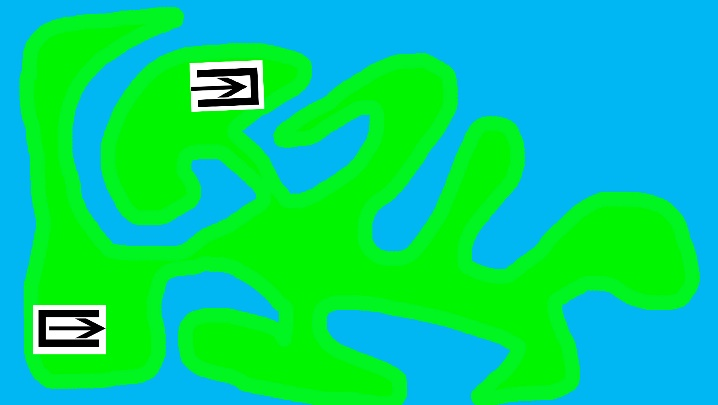<center>Амебное пятно</center></td>
    </tr>
</table>
